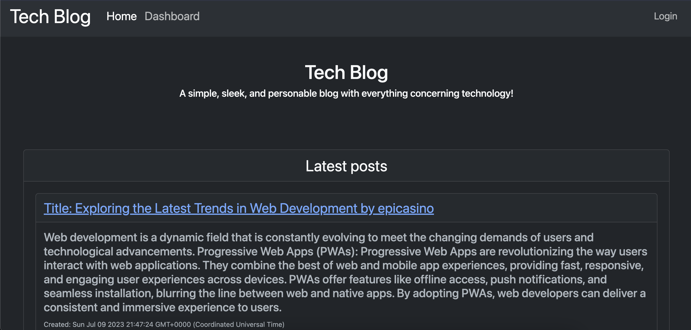
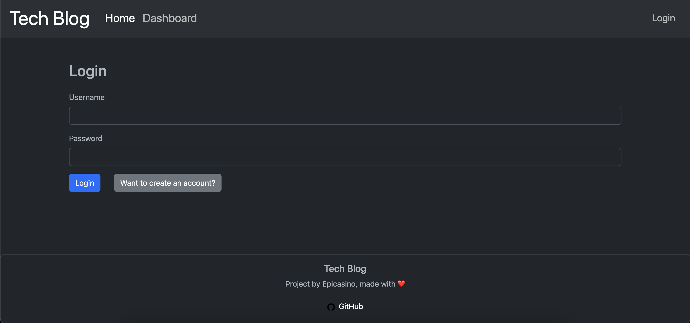
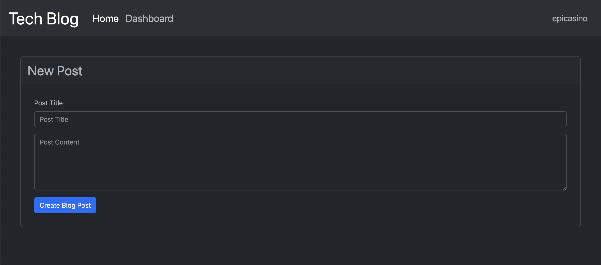
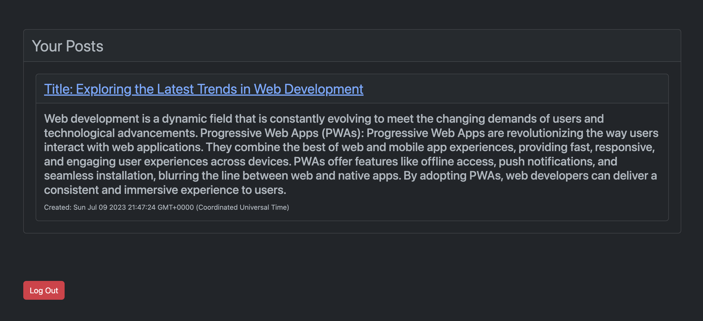
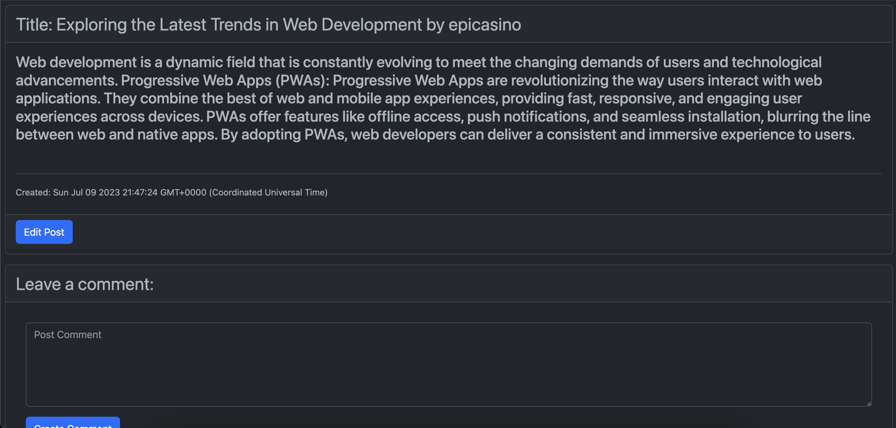
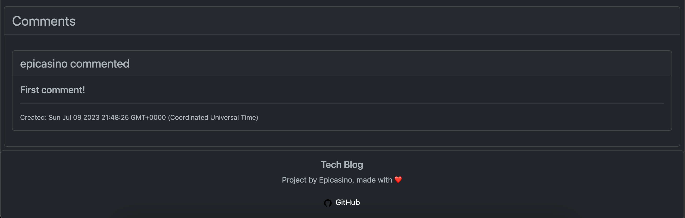
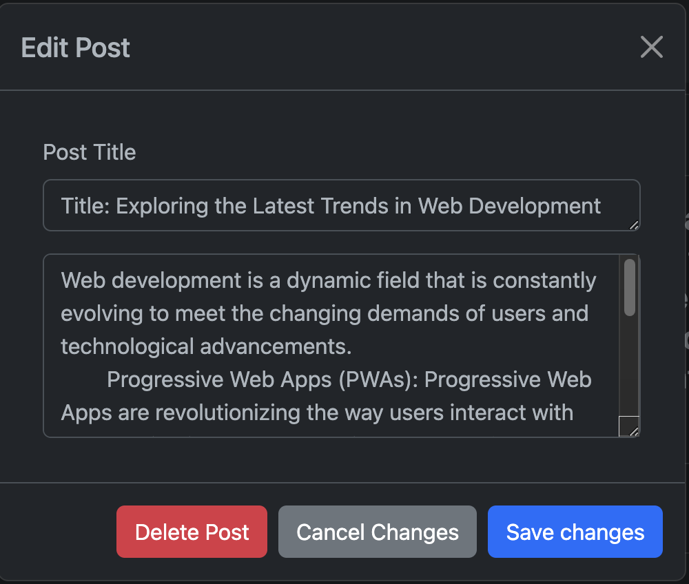

# [Tech Blog](https://tech-blog-epicasino-d449c2752498.herokuapp.com/) (UCSD Challenge #14)

## Description

Provide a short description explaining the what, why, and how of your project. Use the following questions as a guide:

- A tech-style blog application that implements user-made blog posts in a simple, sleek web application.
- Implements a MySQL database w/ sequelize, and Express.js for session-storage and routing. Handlebars used as a view engine.
- Application has implemented appropiate MVC file structure to improve my profienciency in modern-day application file structuring and architecture.

## Installation

No installation is needed to access this application. To access the application, [Click here.](https://tech-blog-epicasino-d449c2752498.herokuapp.com/)
## Usage

**When first visiting the application, you will be presented with the homepage**
**The homepage has a navbar, with options to your user dashboard, and an option to log in.**

**Upon clicking the "login" button, you will be presented with a simple login page.**

**Upon logging in, you will be brought back to the homepage, when clicking on the 'dashboard' on the navbar, you will be presented with this page.**
**You can create new posts on this page, along with viewing all blog posts you have made as well.**

**When clicking on a post, you will be presented with a post page with the post's contents, a comment box, and a comments section.**
**Upon clicking on the "edit post" button, you will be shown a modal to edit, or delete the post.**

## License

MIT License

Copyright (c) 2023 Ray Badua

Permission is hereby granted, free of charge, to any person obtaining a copy
of this software and associated documentation files (the "Software"), to deal
in the Software without restriction, including without limitation the rights
to use, copy, modify, merge, publish, distribute, sublicense, and/or sell
copies of the Software, and to permit persons to whom the Software is
furnished to do so, subject to the following conditions:

The above copyright notice and this permission notice shall be included in all
copies or substantial portions of the Software.

THE SOFTWARE IS PROVIDED "AS IS", WITHOUT WARRANTY OF ANY KIND, EXPRESS OR
IMPLIED, INCLUDING BUT NOT LIMITED TO THE WARRANTIES OF MERCHANTABILITY,
FITNESS FOR A PARTICULAR PURPOSE AND NONINFRINGEMENT. IN NO EVENT SHALL THE
AUTHORS OR COPYRIGHT HOLDERS BE LIABLE FOR ANY CLAIM, DAMAGES OR OTHER
LIABILITY, WHETHER IN AN ACTION OF CONTRACT, TORT OR OTHERWISE, ARISING FROM,
OUT OF OR IN CONNECTION WITH THE SOFTWARE OR THE USE OR OTHER DEALINGS IN THE
SOFTWARE.
